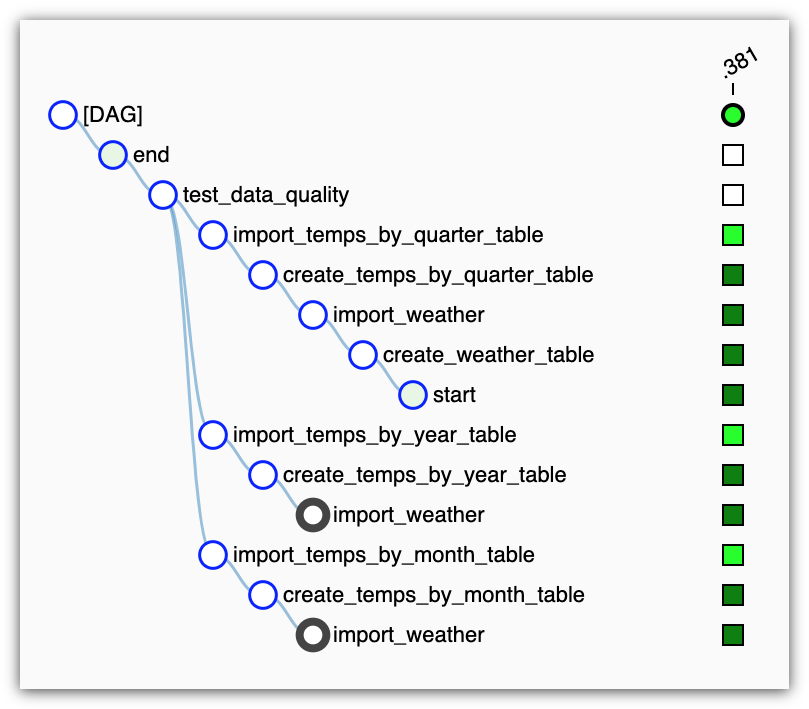

# Capstone project

We want to analyze how the weather in Spain is doing. The Meteorology Statal Agency of Spain (AEMET) gathers weather information from 2500+ meteorology stations every day. These stations are located all over the country, so we can aggregate the data by cities and analyze the metrics in detail.

## Table of contents

- [Description](#description)
- [Structure](#structure)
- [Requirements](#requirements)
  - [Cloning the repository](#cloning-the-repository)
  - [Requesting the AEMET API Key](#requesting-the-aemet-api-key)
- [How to use](#how-to-use)
  - [Running Apache Airflow](#running-apache-airflow)
  - [Configuring connections](#configuring-connections)
    - [AEMET API connection](#aemet-api-connection)
    - [Application database connection](#application-database-connection)
  - [Running the Capstone Project DAG](#running-the-capstone-project-dag)
  - [Analyzing the data](#analyzing-the-data)
- [Cleaning the environment](#cleaning-the-environment)

---

## Description<a name="description"></a>

The premises are:

- The weather data is retrieved via API from a external provider (AEMET); it can be given in any format and maybe wrong typed, so we need a mechanism that retrieve, clean and type the data properly.
- Once the master data is ready, we must store it somewhere. As we want to analyze the weather information, we must think about aggregations: relational databases are a good option.
- Lastly, we are going to clusterize the data by city and by time range -monthly, quarterly and yearly-. We can use the same relational database to create these fact tables.

We can use [Apache Airflow](https://airflow.apache.org/) and [PostgreSQL](https://www.postgresql.org/) to orchestrate the pipeline. It's a simple pipeline; we can run it locally in a Docker services topology. The architecture model can be like this:


- Apache Airflow with a LocalExecutor
- A PostgreSQL instance for Apache Airflow's Database Backend
- A PostgreSQL for the application database.

How this is accomplished with Docker is commented [later](#running-apache-airflow).

The data pipeline is shown below:


- The source data is retrieved from the AEMET API using a custom Apache Airflow hook. This hook queries the API and transforms the response, a JSON object, into a [Pandas](https://pandas.pydata.org/) DataFrame to ease the data wrangling.
- A custom Apache Airflow operator takes the weather DataFrame and pushes it into a staging table in PostgreSQL. This master data will be use as the source for the fact tables.
- Another custom Apache Airflow operator queries the staging table to aggregate the data and insert it in fact tables, also in PostgreSQL.

The data pipeline be monitored from the Apache Airflow console: follow the instructions to set it up!

## Structure<a name="structure"></a>

This tree shows the repository structure. Only the project's main files are described.

```
.
├── images
│   ├── airflow-adhoc-query-01.png
│   ├── airflow-adhoc-query-02.png
│   ├── airflow-adhoc-query-03.png
│   ├── airflow-adhoc-query-04.png
│   ├── airflow-connections.png
│   ├── airflow-dag-01.png
│   ├── airflow-dag-02.png
│   ├── airflow-dag-03.png
│   ├── architecture-model.png
│   ├── data-flow.png
│   └── request-aemet-api-key.png
├── src
│   ├── airflow
│   │   ├── dags
│   │   │   └── capstone.py                  # The capstone project main DAG
│   │   └── plugins
│   │       └── capstone_plugin
│   │           ├── helpers
│   │           │   ├── __init__.py
│   │           │   └── queries.py           # Queries used by the custom operators
│   │           ├── hooks
│   │           │   ├── __init__.py
│   │           │   └── aemet.py             # AEMET API hook
│   │           ├── operators
│   │           │   ├── __init__.py
│   │           │   ├── aggregate_table.py   # Custom operator to aggregate data
│   │           │   ├── create_table.py      # Custom operator to create tables
│   │           │   └── import_weather.py    # Custom operator to import weather data
│   │           └── __init__.py
├── .editorconfig
├── .gitignore
├── docker-compose.yml                       # Descriptor for the capstone project deployment
└── README.md
```

---

## Requirements<a name="requirements"></a>

It is assumed that the tools below are properly installed locally:

- [Docker Engine / Desktop](https://hub.docker.com/search/?type=edition&offering=community) powers millions of applications worldwide, providing a standardized packaging format for diverse applications.

### Requesting the AEMET API Key<a name="requesting-the-aemet-api-key"></a>

We need an API Key in order to retrieve weather data from AEMET. It can be requested from the [AEMET OpenData site](https://opendata.aemet.es/centrodedescargas/inicio) just given an email:


You will be sent a [JSON Web Token](https://jwt.io/): have it on hand, we will use it shortly.

### Cloning the repository<a name="cloning-the-repository"></a>

The first step is to clone this repository. Just type the following command in your Terminal:

```bash
# Clone the repository...
git clone https://github.com/vermicida/capstone-project.git

# ...and move to its directory
cd capstone-project
```

---

## How to use<a name="how-to-use"></a>

Here are listed the steps to follow in order to make the pipeline work.

### Running Apache Airflow<a name="running-apache-airflow"></a>

We lean on Docker to run Apache Airflow. In the root directory of the project you will find the file `docker-compose.yml`: that's the one that make magic happens! It creates a containers topology:

- A container running Apache Airflow with a [LocalExecutor](https://www.astronomer.io/guides/airflow-executors-explained/)
- A container running PostgreSQL as the Apache Airflow's [Database Backend](https://airflow.readthedocs.io/en/stable/howto/initialize-database.html)
- A container running PostgreSQL as the application database.

Also, it mounts the directories `src/airflow/dags` and `src/airflow/plugins` in the Apache Airflow container to be able to work with our Capstone Project DAG.

Let's do it! Run this command in your terminal:

```bash
docker-compose up
```

Wait a minute while Docker is starting the services. Now open your browser and navigate to `http://localhost:8080`: Apache Airflow is running now!

### Configuring connections<a name="configuring-connections"></a>

In the Apache Airflow console, go to the menu **Admin** and select **Connections**:


#### AEMET API connection<a name="aemet-api-connection"></a>

Create a new connection for the AEMET API using the following values:

- **Conn Id:** `aemet_conn`
- **Conn Type:** `HTTP`
- **Host:** `https://opendata.aemet.es/`
- **Extra**: `{"api_key": "your-aemet-api-key"}`

Remeber to replace the value of the property `api_key`, in the **Extra** field, by the JSON Web Token you were given [before](#requesting-the-aemet-api-key).

Click **Save**.

#### Application database connection<a name="application-database-connection"></a>

Create a new connection for the application database using the following values:

- **Conn Id:** `ddbb_conn`
- **Conn Type:** `Postgres`
- **Host:** `ddbb`
- **Schema:** `weather`
- **Login:** `admin`
- **Password:** `P4ssw0rd`
- **Port:** `5432`

Click **Save**.

### Running the Capstone Project DAG<a name="running-the-capstone-project-dag"></a>

You can go to the DAGs menu and see the Capstone Project DAG listed. By default, the operator in charge of importing the weather from the AEMET API, will retrieve any info between **Jun 20th** and **Jul 10th**, but you can change that by editing the DAG file -located at `src/airflow/dag/capstone.py`-, in the instantiation of the operator `ImportWeatherOperator`:

```python
...
import_weather = ImportWeatherOperator(
    task_id='import_weather',
    ddbb_conn_id='ddbb_conn',
    aemet_conn_id='aemet_conn',
    from_date='2019-06-20',       # This is the initial date
    to_date='2019-07-10'          # This is the ending date
)
...
```

Use the standard [ISO 8601](https://en.wikipedia.org/wiki/ISO_8601) to set a date.

Turn **On** the switch next to the DAG name to make the Apache Airflow scheduler run the defined tasks:


You can navigate the DAG details by clicking in its name. The **Graph view** shows a diagram on how the tasks are going to be executed:


You can also check how the Apache Airflow scheduler is doing with the DAG tasks on the **Tree view** tab. Dark green means good!



### Analyzing the data<a name="analyzing-the-data"></a>

You can use the Apache Airflow console to run queries over the fact tables. Go to the option **Ad Hoc Query** in the menu **Data Profiling**:


And run queries like these -don't forget to select the connection `ddbb_conn`-:

```sql

/*
The average, max and min temperatures in Madrid by month
*/

select *
  from temps_by_month
 where city = 'MADRID'
```


```sql
/*
The average, max and min temperatures of the second quarter in Basque Country -higher max temperature first-
*/
   select *
     from temps_by_quarter
    where quarter = 2
      and city = any('{BIZKAIA,GIPUZKOA,ARABA/ALAVA}')
 order by tmax desc
```


```sql
/*
The average, max and min temperatures of the 10 hottest cities this year
*/
   select *
     from temps_by_year
 order by tavg desc
    limit 10
```


---

## Cleaning the environment<a name="cleaning-the-environment"></a>

Once the DAG has been executed, you checked it did well, and queried the fact tables, you can clean the environment by stopping the Apache Airflow and PostgreSQL containers with `Ctrl + C`. When the processes stop, run this command:

```bash
docker-compose down
```

It will delete all the resources created to run Apache Airflow (containers, networks, etc).

And that's all :-)
